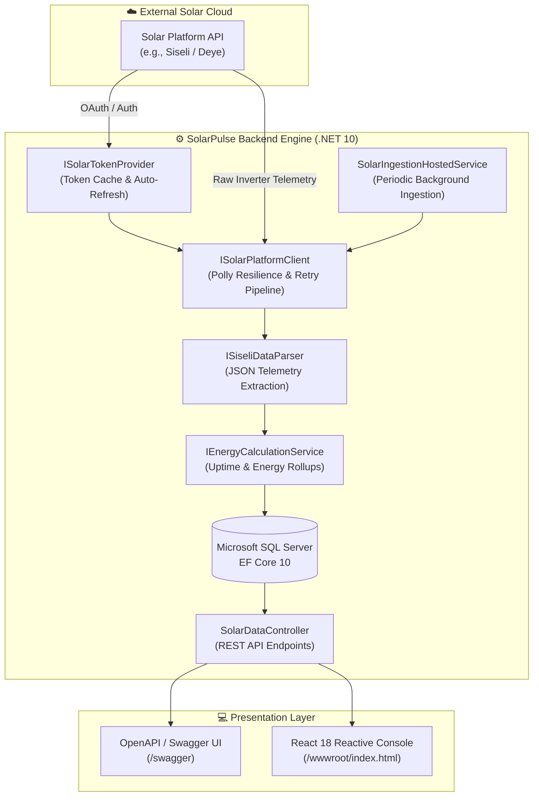

<div align="center">

# ☀️ SolarPulse Dynamics
### Intelligent Solar Inverter Telemetry, Grid Availability & Energy Analytics Platform

[](https://dotnet.microsoft.com/)
[](https://learn.microsoft.com/dotnet/csharp/)
[](https://react.dev/)
[](https://learn.microsoft.com/ef/core/)
[](https://swagger.io/)
[](LICENSE)
[](https://github.com/ahmadTaieb/SolarPulse)

<p align="center">
  <b>A production-grade telemetry aggregation engine and reactive analytics console built to bridge solar inverters, grid reliability tracking, and modern web visualization.</b>
</p>

[Explore Features](#-core-capabilities) •
[System Architecture](#-system-architecture) •
[Interactive Dashboard](#-interactive-dashboard) •
[Quick Start](#-quick-start) •
[API Reference](#-api-documentation) •
[Security](#-enterprise-security--secrets-management)

</div>

---

## 📌 Executive Summary

**SolarPulse** is an end-to-end solar energy monitoring and electrical grid reliability platform. It connects to solar cloud systems (such as Siseli, Deye, and Solarman), continuously ingests instantaneous telemetry, performs automated rollups (daily and hourly energy profiles), calculates national/local grid uptime and blackout durations, and serves both a REST API and a glassmorphic React dashboard.

Designed with enterprise patterns in mind, SolarPulse uses **.NET 10**, **Entity Framework Core 10**, resilient HTTP pipelines powered by **Polly**, and automated database migrations.

---

## 🌟 Core Capabilities

| Capability | Description |
| :--- | :--- |
| **🔄 Automated Cloud Telemetry Ingestion** | Background worker (`IHostedService`) polls cloud APIs on a configurable schedule with automatic token refresh, token caching, and rate limiting. |
| **⚡ Grid Outage & Availability Tracking** | Precise calculation of continuous grid connected hours, blackout/outage hours, and weekly/monthly uptime percentages ($0 - 100\%$). |
| **📈 Diurnal 24-Hour Energy Profiling** | Aggregates 24 hourly buckets per day, contrasting Photovoltaic (PV) generation against Grid consumption and total home/facility load. |
| **📊 Glassmorphic Live Dashboard** | Ultra-responsive React 18 UI featuring real-time telemetry tickers, semi-circular SVG availability gauges, monthly breakdown charts, and CSV telemetry exports. |
| **🌓 Dynamic Theming** | Fully integrated dark and light themes using CSS design tokens for optimal day/night visibility in control rooms. |
| **🛡️ Resilient Network Architecture** | Built on `Microsoft.Extensions.Http.Resilience` with automatic exponential backoff, jittered retries, and circuit breakers. |
| **🗃️ Automatic Schema Migrations** | Automatically applies Entity Framework Core SQL Server migrations on startup. |

---

## 🏗️ System Architecture

SolarPulse separates concern across a pipeline of background services, resilient domain clients, and presentation layers:



---

## 📊 Interactive Dashboard Highlights

The frontend console is built as an interactive, single-page reactive application embedded directly in ASP.NET Core:

* **Weekly Availability Gauge**: Displays a dynamic arc gauge calculating rolling 7-day electrical grid uptime (e.g. `84.5% Availability`), identifying blackout patterns.
* **Monthly Power Overview**: Tracks Total Consumption, Grid Energy share (`kWh`), and Solar Generation share (`kWh`) with interactive progress ratios.
* **Diurnal 24-Hour Energy Profiles**: Stacked bar charts showing daytime solar generation peaks versus nighttime grid dependence.
* **Instantaneous Telemetry Banner**: Shows real-time DC array voltage, inverter output power, battery charge percentage, and internal inverter temperature.
* **Data Portability**: One-click CSV export generating formatted records (`Date`, `GridConnectedHours`, `GridOutageHours`, `GridConsumptionKwh`, `SolarConsumptionKwh`, `TotalConsumptionKwh`).

---

## 📁 Repository Structure

```
SolarPulse/
├── 📁 Solar/                                # Main .NET 10 ASP.NET Core Application
│   ├── 📁 Controllers/                     # REST API Controllers (SolarDataController)
│   ├── 📁 Data/                            # Entity Framework Core DbContext
│   ├── 📁 Entities/                        # Database Entities (InverterReading, DailyEnergyMetric)
│   ├── 📁 Extensions/                      # DI & Startup Extensions (Resilience, CORS, Migrations)
│   ├── 📁 HostedServices/                  # Background Worker (SolarIngestionHostedService)
│   ├── 📁 Migrations/                      # EF Core Code-First Migrations
│   ├── 📁 Models/                          # DTOs, API Requests/Responses & Ingestion Models
│   ├── 📁 Options/                         # Strongly-typed configuration (SolarPlatformOptions)
│   ├── 📁 Properties/                      # Launch settings & profiles
│   ├── 📁 Services/                        # Business Logic & Infrastructure
│   │   ├── 📁 Auth/                        # Cloud Token Provider & Auth Management
│   │   ├── 📁 Calculations/                # Energy & Outage Math Services
│   │   ├── 📁 Parsers/                     # Raw Payload Parsers
│   │   └── 📁 Telemetry/                   # Telemetry Ingestion & Query Services
│   ├── 📁 wwwroot/                         # Single-file React 18 Production Dashboard
│   ├── 📄 appsettings.json                 # Base application configuration (safe placeholders)
│   ├── 📄 appsettings.Example.json         # Reference configuration template
│   ├── 📄 Program.cs                       # WebApplication entrypoint & pipeline config
│   └── 📄 Solar.csproj                     # MSBuild project definition
│
├── 📁 Solar.Tests/                          # Automated Testing Suite (xUnit)
│   ├── 📄 EnergyCalculationServiceTests.cs # Unit tests for energy & uptime rollups
│   ├── 📄 MonthlyMetricsTests.cs           # Tests for monthly metric aggregations
│   ├── 📄 SiseliDataParserTests.cs         # Tests for payload deserialization
│   └── 📄 Solar.Tests.csproj               # Test project definition
│
├── 📄 .gitignore                           # Comprehensive exclusion rules (bin, obj, secrets)
├── 📄 LICENSE                              # MIT License
├── 📄 README.md                            # Project documentation
├── 📄 Solar.slnx                           # Modern XML solution definition
├── 📄 SolarDashboard.tsx                   # Standalone TypeScript React Component
├── 📄 SolarDashboard.jsx                   # Standalone JSX React Component
└── 📄 solar-dashboard-preview.html         # Offline HTML preview file
```

---

## ⚙️ Configuration Reference

All settings can be provided via `appsettings.json`, .NET User Secrets, or Environment Variables:

| Configuration Key | Type | Default | Description |
| :--- | :--- | :--- | :--- |
| `ConnectionStrings:SolarDatabase` | `string` | *(Required)* | SQL Server connection string with encryption parameters. |
| `SolarPlatform:BaseUrl` | `string` | `https://solar.siseli.com` | Base URL of the inverter cloud API endpoint. |
| `SolarPlatform:Email` | `string` | *(Required)* | Account email for cloud portal authentication. |
| `SolarPlatform:Password` | `string` | *(Required)* | Account password for cloud portal authentication. |
| `SolarPlatform:SyncIntervalMinutes` | `int` | `60` | Telemetry polling frequency in minutes. |
| `SolarPlatform:StationId` | `string` | *(Required)* | Unique station/plant identifier assigned by the cloud system. |
| `SolarPlatform:DeviceId` | `string` | *(Required)* | Inverter hardware device ID / serial identifier. |
| `SolarPlatform:TimeZone` | `string` | `Asia/Damascus` | Target IANA timezone for local diurnal aggregation. |
| `SolarPlatform:ApplyMigrationsOnStartup` | `bool` | `true` | When true, executes EF Core `Database.MigrateAsync()` on boot. |

---

## 🚀 Quick Start

### 1. Prerequisites
* [.NET 10 SDK](https://dotnet.microsoft.com/download/dotnet/10.0) (v10.0 or later)
* [SQL Server](https://www.microsoft.com/sql-server/) (LocalDB, SQL Express, or Azure SQL)

### 2. Clone the Repository
```bash
git clone https://github.com/ahmadTaieb/SolarPulse.git
cd SolarPulse
```

### 3. Configure Local Credentials
Use [.NET User Secrets](https://learn.microsoft.com/aspnet/core/security/app-secrets) to keep your passwords securely stored on your local workstation without touching source code:

```bash
# Initialize User Secrets for the Solar project
dotnet user-secrets init --project Solar

# Configure your SQL Server connection string
dotnet user-secrets set "ConnectionStrings:SolarDatabase" "Server=localhost;Database=SolarPulseDb;Trusted_Connection=True;TrustServerCertificate=True;" --project Solar

# Configure your Solar Cloud credentials
dotnet user-secrets set "SolarPlatform:Email" "your_user@domain.com" --project Solar
dotnet user-secrets set "SolarPlatform:Password" "your_secure_password" --project Solar
dotnet user-secrets set "SolarPlatform:StationId" "520550594498498560" --project Solar
dotnet user-secrets set "SolarPlatform:DeviceId" "520550594544635905" --project Solar
```

### 4. Build and Run
```bash
dotnet run --project Solar
```

On first launch, EF Core will automatically initialize the database schema.

### 5. Access the Platform
* **Live React Dashboard**: [http://localhost:5000](http://localhost:5000)
* **Interactive Swagger UI**: [http://localhost:5000/swagger](http://localhost:5000/swagger)

---

## 📡 API Documentation

### Key Endpoints

#### 1. Instantaneous Inverter Telemetry
```http
GET /api/solar/telemetry/latest?deviceId={deviceId}
```
**Sample Response (`200 OK`):**
```json
{
  "id": 1408,
  "deviceId": "520550594544635905",
  "timestamp": "2026-10-03T00:30:00Z",
  "pvPowerWatts": 4250.0,
  "gridPowerWatts": 120.0,
  "loadPowerWatts": 2840.0,
  "batterySocPercentage": 92.5,
  "batteryPowerWatts": -1530.0,
  "inverterTemperatureCelsius": 41.2,
  "isGridConnected": true
}
```

#### 2. Daily Energy & Grid Availability
```http
GET /api/solar/metrics/daily?fromDate=2026-09-01&toDate=2026-09-30
```
**Sample Response (`200 OK`):**
```json
[
  {
    "date": "2026-09-20",
    "gridConnectedHours": 20.25,
    "gridOutageHours": 3.75,
    "gridAvailabilityPercentage": 84.38,
    "gridConsumptionKwh": 14.82,
    "pvGenerationEnergyKwh": 26.40,
    "totalLoadKwh": 37.10
  }
]
```

#### 3. Hourly Diurnal Profile Breakdown
```http
GET /api/solar/metrics/hourly-grid?fromDate=2026-09-20&toDate=2026-09-20
```

#### 4. Trigger Instant Cloud Sync
```http
POST /api/solar/sync-now
```

---

## 🛡️ Enterprise Security & Secrets Management

* **Zero Plaintext Secrets**: Real database credentials and portal passwords are never committed to version control. The included `.gitignore` strips `.env`, `publish/`, `bin/`, `obj/`, and local secret files.
* **Environment Variable Compatibility**: In production or containerized environments (Docker / Kubernetes), override settings using standard environment variables:
  ```bash
  ConnectionStrings__SolarDatabase="Server=...;Database=...;"
  SolarPlatform__Email="prod_service@domain.com"
  SolarPlatform__Password="ProductionPassword"
  ```
* **Resilience & Fault Isolation**: Cloud API throttling or temporary downtime will not crash the application thanks to Polly circuit breaking and retry policies.

---

## 🧪 Automated Testing

SolarPulse includes a suite of unit tests verifying mathematical accuracy for energy integrals and outage detection:

```bash
# Run all unit tests
dotnet test

# Run tests with detailed verbosity
dotnet test --logger "console;verbosity=detailed"
```

All 7 core test suites execute in under 1 second:
* `EnergyCalculationServiceTests`: Verifies Simpson's / Trapezoidal rule calculation and uptime detection.
* `MonthlyMetricsTests`: Confirms monthly aggregation and solar share percentage formulas.
* `SiseliDataParserTests`: Validates resilient JSON telemetry parsing against malformed cloud payloads.

---

## 🤝 Contributing

Contributions, issues, and feature requests are welcome!
1. Fork the Project.
2. Create your Feature Branch (`git checkout -b feature/AmazingFeature`).
3. Commit your Changes (`git commit -m 'feat: add AmazingFeature'`).
4. Push to the Branch (`git push origin feature/AmazingFeature`).
5. Open a Pull Request.

---

## 📄 License

Distributed under the **MIT License**. See [`LICENSE`](LICENSE) for more details.

---

<div align="center">
  <sub>Engineered by <a href="https://github.com/ahmadTaieb">Ahmad Taieb</a> • Built with .NET 10, C# 13, and React 18</sub>
</div>
